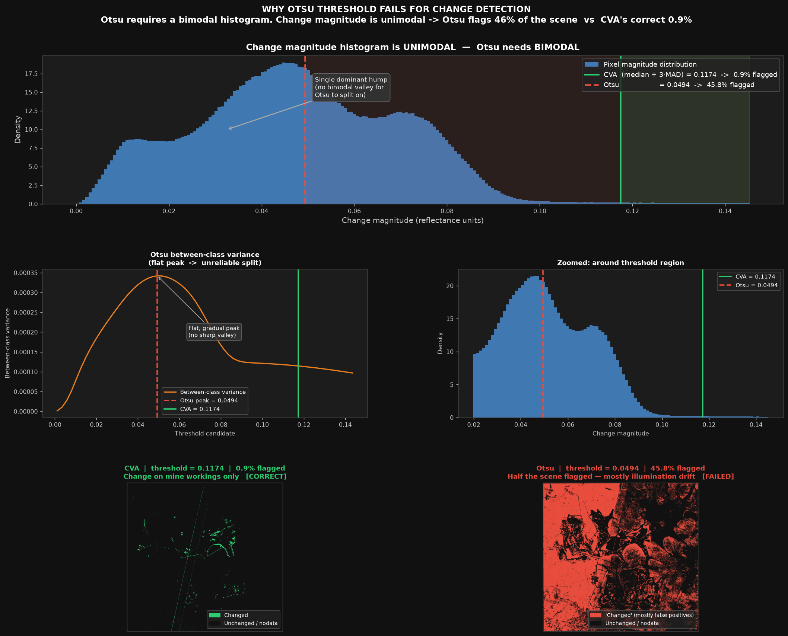
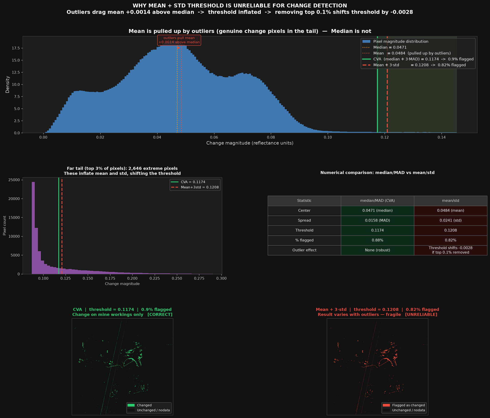
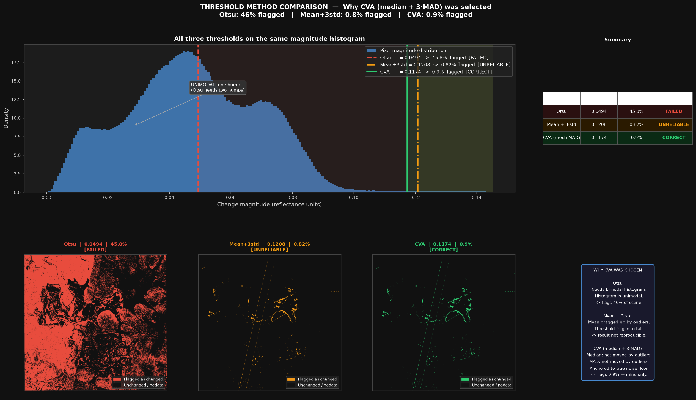

# Change Analysis Report — Sentinel-2, Open-Pit Mine (Zambia)

**Dates compared:** 2023-08-12 (before) → 2023-09-02 (after) · 21-day gap
**Sensor:** Sentinel-2, 10 m optical bands B02 (Blue), B03 (Green), B04 (Red)
**AOI:** open-pit mining site, Zambia · EPSG:32735 (UTM 35S)

---

## 1. Method

### What the pipeline does

1. **Scale to reflectance.** Raw pixel values (DN) are divided by 10000 so the
   numbers are in true reflectance units and can be compared between dates.
2. **Compute change magnitude.** For each pixel, subtract the before value from
   the after value in all three bands, then take the length of that difference
   vector (square root of the sum of squared differences). This gives one number
   per pixel — how much it changed overall across all three bands.
3. **Decide what counts as changed.** Find the median magnitude and the MAD
   (a robust measure of spread). A pixel is called "changed" if its magnitude
   is more than 3 × 1.4826 × MAD above the median. For this scene that
   threshold is **0.117 reflectance units**, which flags **0.88%** of pixels.
4. **Exclude nodata.** Any pixel that is zero in any band on either date is
   ignored.

### Why CVA — three threshold methods compared

Before settling on median/MAD, I tested three different ways to decide the
change threshold on the same data. The scripts in `src/` produce figures for
each one.

---

**Otsu** (`python src/otsu_threshold.py` → `outputs/otsu_threshold.png`)

Otsu tries to find the point on the histogram that best splits pixels into two
groups: "unchanged" and "changed". It works well when there are two clear bumps
in the histogram with a valley between them.

The problem: this scene has only one bump. Almost all pixels have a small change
(atmospheric drift over 21 days), not a clear two-group split. Otsu picks
roughly the middle of the single hump and flags **45.75%** of the scene — nearly
half the image. That is obviously wrong for three weeks of dry-season mining
where most land did not change.

---

**Mean + 3·std** (`python src/mean_std_threshold.py` → `outputs/mean_std_threshold.png`)

This puts the threshold at three standard deviations above the mean. The mean gets pulled upward by the very pixels that are genuinely
changed (mines, newly excavated areas) — the outliers in the tail. By removing just
the top 0.1% of pixels, the threshold shifts by 0.003 reflectance units.
That instability means the result would be different if is run on a slightly
different crop of the scene or a different date which is not reliable.

---

**CVA — median + 3·MAD** (selected)

The median is not affected by outliers. Neither is the MAD. Even if 5% of the
scene has dramatic change, those pixels do not move the median or MAD. The
threshold stays anchored to the typical background noise level and flags only
**0.88%** — consistent with a few weeks of active mining on a site that is
otherwise stable.

| Method | Threshold | % flagged | Verdict                                     |
|--------|-----------|-----------|---------------------------------------------|
| Otsu | ~0.047 | 45.75% | Failed — histogram has one peak, not two    |
| Mean + 3·std | ~0.116 | 0.82% | Unreliable — threshold shifts with outliers |
| CVA (median + 3·MAD) | 0.117 | 0.88% | Better — anchored to background noise       |

### Why not NDVI or other band indices?

The dataset only contains Blue, Green, and Red bands. NDVI needs the NIR band
(B08), which is not present. CVA uses all three available bands at once, so it
captures both brightness and colour changes — the most information you can get
from these three bands without NIR.

### Comparison with the provided baseline

The provided `example_change_detection.py` computes the same Euclidean distance
but on raw DN values and scales with min–max. One bright outlier pixel can
stretch the entire scale, making everything else look nearly zero (the mean
output is ~10/255). The CVA pipeline fixes this by using reflectance and a
robust threshold, and also produces the binary mask and vector polygons that
the baseline does not.

---

## 2. Results

- **156 change polygons** kept after dropping speckle smaller than 2000 m².
- Total changed area: **~186 ha**.
- Polygon sizes range from small (<0.5 ha) to a largest feature of **33 ha**.
- The top five polygons (33, 10, 8, 8, 6 ha) cover much of the flagged area.
- Per-polygon confidence (average change intensity inside the polygon) ranges
  from **0.56 to 0.91** — bigger pit features have higher confidence.

**Where change occurs:**
- The biggest, most clustered detections are on the **active pit faces and
  benches** — material removed, surface brightness changed over three weeks.
- More detections appear on the **tailings / processing area** and along the
  edges of **water bodies** (pit lakes, tailings ponds) where water level or
  turbidity shifted.
- The surrounding bushland is almost entirely no-change, as expected in a short
  dry-season window.
- A faint diagonal line is visible in the intensity map — that is a sensor
  artifact, explained below.

---

## 3. What the detections represent

- **Open-pit mining activity.** Excavation, bench reshaping, spoil movement —
  all change surface brightness and colour. These are the high-confidence
  polygons on the pit.
- **Water / tailings dynamics.** Pond edges and water colour can shift in
  three weeks with pumping and sediment load.
- **Vegetation (minimal).** Late dry season, so surrounding bush is mostly
  stable. Very few low-confidence specks appear off-site.
- **Atmospheric and illumination drift (filtered out).** The 21-day gap means
  every pixel is slightly brighter in the after image. The median/MAD threshold
  is designed to ignore this global shift.
- **Sensor artifact (diagonal seam).** See below.

---

## 4. The diagonal artifact — what it is and why it does not matter

Reproduce with `python src/artifact_diagnostics.py` →
`outputs/artifact_diagnostics.png`.

**What it is.** The diagonal stripe in the intensity map only appears in the
difference image, not in either single-date image on its own. Sentinel-2 is
built from several detector modules that each cover a strip of the swath. On
different acquisition dates the same ground point may be viewed by a slightly
different module. This small brightness mismatch between modules shows up as a
diagonal stripe when you subtract the two dates.

**Does it affect results?** No. The stripe has a magnitude of about 0.047
reflectance units. The robust threshold is 0.117 — more than twice as high.
The stripe falls below the threshold and never makes it into the detected
polygons. All the flagged polygons are on the mine, not along the diagonal.

**Can it be removed?** The current pipeline already handles it well:
- The robust threshold (0.117) is above the seam bias (0.047) → seam excluded.
- The 2000 m² minimum area filter drops any small seam speckle that might
  squeak through.

A Gaussian background subtraction is also available (`REMOVE_BACKGROUND = True`
in config). It cleans up the intensity *picture* but lowers the noise floor,
causing the detector to pick up vegetation texture and minor co-registration
edges — 156 polygons grows to 494, with many false positives. Off by default.

The proper production fix (a detector-footprint mask using the `MSK_DETFOO`
file in the Sentinel-2 SAFE package) is not possible here because only the
clipped band files were provided.

---

## 5. Limitations

- No cloud or shadow mask. Any thin cloud edge would look like change. The
  scenes appear clear over this AOI.
- "Confidence" is a relative score, not a probability. Two polygons with
  confidence 0.6 and 0.9 differ in how strong the change signal is, but
  neither number is a true probability of being correct.
- The threshold is global (one value for the whole scene). A spatially varying
  threshold would handle scenes with strong lighting gradients better.
- Without NIR, vegetation change and mining change cannot be separated — any
  spectral change in RGB is flagged equally.

---

## 6. Summary

CVA with median/MAD flags **0.88%** of the scene (156 polygons, ~186 ha),
concentrated on active pit faces, tailings, and water edges — exactly what
we can expect from three weeks of open-pit mining. Otsu flagged 45.75%
(mostly illumination noise). Mean/std gives an unstable threshold that shifts
whenever the data distribution shifts slightly. Median/MAD anchors the
threshold to the true noise floor and stays there regardless of outliers.
